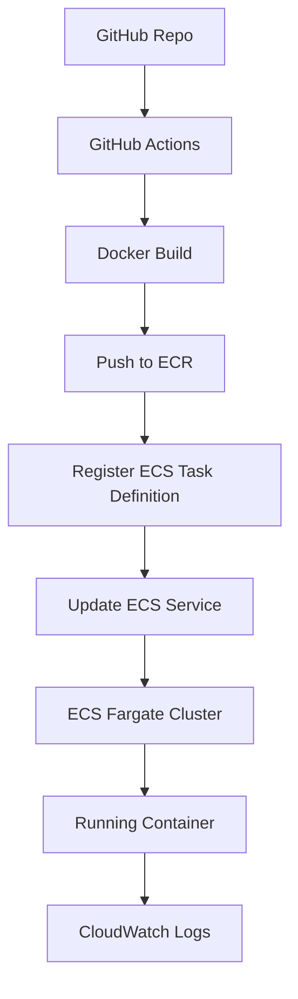

---

# 📦 WMS Microservice CI/CD Deployment on AWS

This project demonstrates end-to-end DevOps automation to deploy a sample Warehouse Management System (WMS) microservice to **AWS ECS Fargate**, using:

* **Terraform** for infrastructure provisioning
* **GitHub Actions** for CI/CD
* **Amazon ECR** for container image storage
* **CloudWatch** for centralized logging

---

## ✨ Features

✅ Infrastructure-as-Code (Terraform)
✅ CI/CD Pipeline (GitHub Actions)
✅ Secure image storage in Amazon ECR
✅ Automatic task definition revisions
✅ Auto-deployment to ECS Fargate
✅ Centralized monitoring with CloudWatch Logs

---

## 🏗️ Architecture Overview



---

## 🛠️ Infrastructure Components

| Resource            | Description                                     |
| ------------------- | ----------------------------------------------- |
| **ECR Repository**  | Stores Docker images                            |
| **ECS Cluster**     | Fargate cluster to run containers               |
| **Task Definition** | Defines container spec (CPU, memory, logs)      |
| **ECS Service**     | Ensures the desired number of tasks are running |
| **IAM Role**        | Grants ECS permissions to pull images and log   |
| **CloudWatch Logs** | Centralized container logging                   |

---

## 📋 Terraform (`main.tf`)

Terraform provisions all infrastructure:

* ECS Cluster
* Task Definition
* Service
* IAM roles
* Security Groups
* Log Groups

> **Tip:** See `main.tf` in this repo for the complete example.

---

## ⚙️ CI/CD Pipeline (GitHub Actions)

The pipeline is triggered on any push to `main`.
It performs these steps:

1. **Checkout Code**
2. **Configure AWS Credentials**
3. **Login to Amazon ECR**
4. **Build Docker Image**
5. **Tag and Push to ECR**
6. **Register ECS Task Definition**
7. **Update ECS Service to deploy the new revision**

✅ Pipeline file: `.github/workflows/deploy.yml`

---

## 🧩 Environment Variables & Secrets

Configure these GitHub **Secrets** in your repository:

| Secret Name             | Example Value             |
| ----------------------- | ------------------------- |
| `AWS_ACCESS_KEY_ID`     | `AKIA***********`         |
| `AWS_SECRET_ACCESS_KEY` | `***********************` |
| `AWS_REGION`            | `us-east-1`               |
| `AWS_ACCOUNT_ID`        | `123456789012`            |
| `ECR_REPOSITORY`        | `wms-sample-repo`         |
| `ECS_CLUSTER`           | `wms-ecs-cluster`         |
| `ECS_SERVICE`           | `wms-ecs-service`         |
| `ECS_TASK_DEFINITION`   | `wms-task`                |

---

## 🚀 How to Deploy

### ✅ Prerequisites

* AWS Account
* AWS CLI configured locally
* Terraform installed
* GitHub repository with your application code and pipeline YAML

---

### ✅ 1️⃣ Create the ECR Repository

```bash
aws ecr create-repository --repository-name wms-sample-repo
```

---

### ✅ 2️⃣ Provision Infrastructure

```bash
terraform init
terraform apply
```

Terraform will:

* Create ECS Cluster
* Create IAM Roles
* Create ECS Service
* Setup CloudWatch Logs

---

### ✅ 3️⃣ Push Code to GitHub

On push to `main`, the GitHub Actions workflow will:

* Build and tag your Docker image
* Push to ECR
* Register new ECS Task Definition
* Update ECS Service

---

### ✅ 4️⃣ Verify Deployment

* Go to **AWS ECS Console**
* Confirm your task is running
* Locate the **public IP**
* Test the app:

```bash
curl http://<public-ip>
```

---

## 📈 Monitoring

Logs are sent to **CloudWatch Logs** under:

```
/ecs/wms-logs
```

You can view logs in AWS Console for debugging and monitoring.

---

## ⚠️ Cost Management

This project uses:

* ECS Fargate compute
* CloudWatch Logs
* ECR storage

**Remember to delete resources when done to avoid charges:**

```bash
terraform destroy
```

or scale the ECS Service to 0 tasks.

---

## 📂 Repository

[GitHub Repository Link]([https://github.com/yourusername/wms-sample-deploy](https://github.com/AshutoshKumar7001/WMS))

---

## ✨ Credits

Created as part of the **DevOps / Cloud Engineer Assignment** to demonstrate:

* Infrastructure as Code
* CI/CD automation
* Cloud-native container deployment

---

## 📝 Contact

If you have questions, feel free to reach out or open an issue.

---
